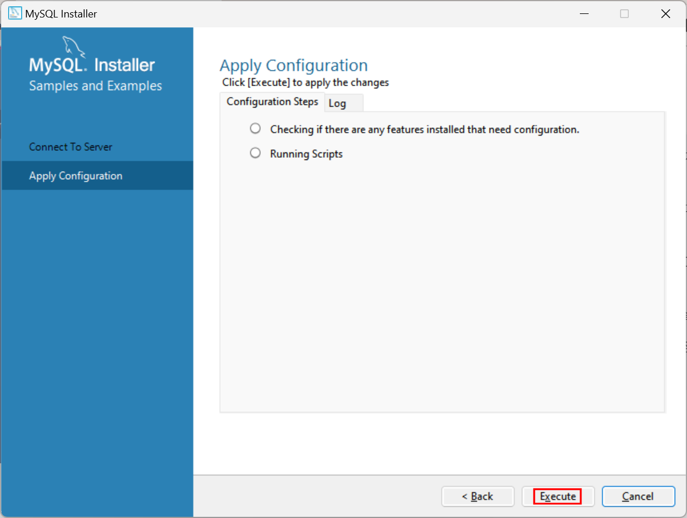

### MySQL 설치 및 설정

---


[**MySQL Community8.0 최신버전 다운로드**](https://dev.mysql.com/downloads/windows/installer/8.0.html)

위 다운로드 링크를 열면2가지 설치 파일이 제공되는데 그 중 303.6MB용량의 `mysql-installer-community-8.0.39.0.msi`파일을 다운로드 한다.


다운로드한  `mysql-installer-community-8.0.39.0.msi`파일을 더블클릭하여 설치를 시작한다.

Choosing Setup Type 단계에서 Custom을 선택 후 [Next] 버튼을 클릭한다.


Select Products 단계에서 **1/3** MySQL Server 8.0.39 - X64를 선택 후,  를 클릭하여 Products To Be Installed 영역에 `MySQL Server 8.0.39 - X64`가 표시되게 한다. 


같은 요령으로 **2/3** MySQLWorkbench 8.0.38 - X64를 선택 후,  를 클릭하여 Products To Be Installed 영역에 `MySQLWorkbench 8.0.38 - X64`가 표시되게 한다. 


역시 같은 요령으로 **3/3** Samples and Examples 8.0.39 - X86를 선택 후,  를 클릭하여 Products To Be Installed 영역에 `Samples and Examples 8.0.39 - X86`가 표시되게 한다. 


여기까지 진행했다면 Products To Be Installed 영역에 `MySQL Server 8.0.39 - X64`, `MySQLWorkbench 8.0.38 - X64`, `Samples and Examples 8.0.39 - X86`3가지가 표시되어 있는 것을 확인 했다면 [Next] 버튼을 클릭한다.


Installation에서는 전 단계에서 선택한 Product가 설치목록과 일치하는 지 확인 후 [Excute] 버튼을 클릭한다.


설치결과 화면의 Status 필드가 모든 Product에 대해서 Complete인 것을 확인 후, [Next] 버튼을 클릭한다. 


Product Configuration 화면에서Product 목록에서 `MySQL Server 8.0.39 - X64`, `Samples and Examples 8.0.39 - X86`를 확인 후, [Next] 버튼을 클릭한다.


Type and Networking 화면에서 Show Advanced and Logging Options에 체크하고, 나머지는 기본 설정을 유지한 채로 [Next] 버튼을 클릭한다. 


Authetification Method 화면에서는 Use Legcy Authentification Method( Retain MySQL 5.x Compatibility )를 선택 후, [Next] 버튼을 클릭한다. 


Accounts and Roles 화면에서 MySQL Root Password와 Repeat Password에 `1234`를, 입력 후, [Next] 버튼을 클릭한다. 


Windows Service 화면에서는 Windows Service에 `MySQL`을 입력 후, 나머지 설정은 기존값을 유지한 채로 [Next] 버튼을 클릭한다. 


Server File Permissions에서는 모든 선택을 기존값을 유지한 채로  [Next] 버튼을 클릭한다. 


Logging Options 역시 모든 선택을 기존값을 유지한 채로  [Next] 버튼을 클릭한다. 


Advanced Options 역시 모든 선택을 기존값을 유지한 채로  [Next] 버튼을 클릭한다. 


Apply Configuration 에서 지금까지의 설정을 적용하기 위해 [Excute] 버튼을 클릭한다. 


모든 Configuration Steps에 초록색 체크가 표시되고, The configuration for MySQL Server 8.0.39 was successful. 메세지를 확인 후, [Finish] 버튼을 클릭한다. 


Product Configuration의 Product에 MySQL Server 8.0.39의 Status가 Configuration complete인 것을 확이 후,  [Next] 버튼을 클릭한다. 


Connect To Server화면에서 Password에 `1234`를 입력 후, [Check] 버튼을 클릭한다. 


Status에 초록 바탕에 Connection Succeeded. 메세지 확인 후,  [Next] 버튼을 클릭한다. 


Apply Configuration에서  [Excute] 버튼을 클릭한다. 



모든 Configuration Steps에 초록색 체크가 표시되고, The configuration for Samples and Examples 8.0.39 was successful. 메세지를 확인 후, [Finish] 버튼을 클릭한다. 


Product Configuration 화면의 모든 Product의 Status가 Complete인 것을 확인 후, [Next] 버튼을 클릭한다. 


Start MySQL Workbench after setup의 체크를 해제하고  [Finish] 버튼을 클릭한다. 


이것으로 MySQL 설치가 모두 완료되었다. 몇가지 확인을 위해 시작 - 모든 앱 - MySQL - MySQL 8.0 Command Line Client를 실행한다.


```
Enter password: 
```

패스워드 `1234`를 입력한다. 

```sql
Enter password: ****
Welcome to the MySQL monitor.  Commands end with ; or \g.
Your MySQL connection id is 19
Server version: 8.0.39 MySQL Community Server - GPL

Copyright (c) 2000, 2024, Oracle and/or its affiliates.

Oracle is a registered trademark of Oracle Corporation and/or its
affiliates. Other names may be trademarks of their respective
owners.

Type 'help;' or '\h' for help. Type '\c' to clear the current input statement.

mysql>
```

사용 가능한 DB 목록을 출력하기 위해 다음 명령을 실행시켜 보자

```sql
show databases;
```

```sql
mysql> show databases;
+--------------------+
| Database           |
+--------------------+
| information_schema |
| mysql              |
| performance_schema |
| sakila             |
| sys                |
| world              |
+--------------------+
6 rows in set (0.01 sec)

mysql>
```

작업 DB를 `mtsql`로 변경하기 위해 다음 명령을 실행시켜 보자.

```sql
use mysql;
```

```sql
mysql> use mysql
Database changed
mysql>
```

`mysql` DB의 테이블 목록을 출력하기 위해 다음 명령을 실행시켜 보자.

```
show tables
```

```sql
mysql> show tables;
+------------------------------------------------------+
| Tables_in_mysql                                      |
+------------------------------------------------------+
| columns_priv                                         |
| component                                            |
| db                                                   |
| default_roles                                        |
| engine_cost                                          |
| func                                                 |
| general_log                                          |
| global_grants                                        |
| gtid_executed                                        |
| help_category                                        |
| help_keyword                                         |
| help_relation                                        |
| help_topic                                           |
| innodb_index_stats                                   |
| innodb_table_stats                                   |
| ndb_binlog_index                                     |
| password_history                                     |
| plugin                                               |
| procs_priv                                           |
| proxies_priv                                         |
| replication_asynchronous_connection_failover         |
| replication_asynchronous_connection_failover_managed |
| replication_group_configuration_version              |
| replication_group_member_actions                     |
| role_edges                                           |
| server_cost                                          |
| servers                                              |
| slave_master_info                                    |
| slave_relay_log_info                                 |
| slave_worker_info                                    |
| slow_log                                             |
| tables_priv                                          |
| time_zone                                            |
| time_zone_leap_second                                |
| time_zone_name                                       |
| time_zone_transition                                 |
| time_zone_transition_type                            |
| user                                                 |
+------------------------------------------------------+
38 rows in set (0.02 sec)
```

테이블 목록 중 현재 관심을 두고 있는 것은 `user`테이블이다. `user`테이블의 모든 레코드의 `user`필드와 `host`  출력을 위해 다음 명령을 실행시켜 보자.

```
select user, host from user;
```

```
mysql> select user, host from user;
+------------------+-----------+
| user             | host      |
+------------------+-----------+
| mysql.infoschema | localhost |
| mysql.session    | localhost |
| mysql.sys        | localhost |
| root             | localhost |
+------------------+-----------+
4 rows in set (0.00 sec)

mysql>
```

지금 설치한 MySQL DB에 등록된 사용자는 4명임을 알 수 있다. 


[목차](../README.md) 
